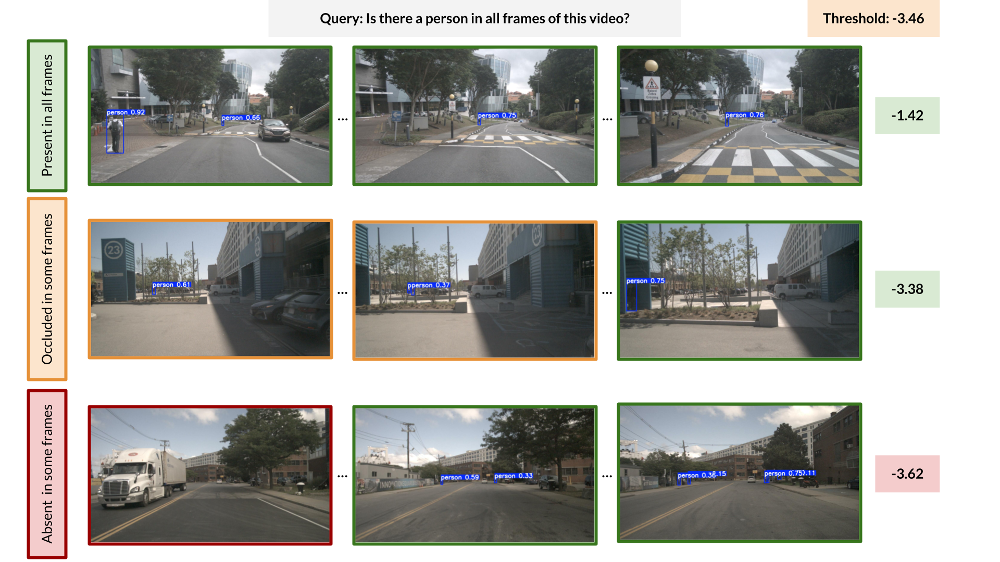

# LogSTOP: Scores for temporal properties over sequences

This repository contains code for an updated version of the paper ["LogSTOP: Temporal Scores over Prediction Sequences for Matching and Retrieval"](https://arxiv.org/abs/2510.06512).

We provide scripts to evaluate query matching and text to video retrieval using videos and temporal properties of your choice. While we only include YOLOv8x as an example of a local property predictor (local properties = objects here), we discuss how you could include your own custom local property predictors below.

Please feel free to reach out to <akhare@seas.upenn.edu> to discuss applications to other domains (temporal properties over multimodal data, for example) and other local properties (actions, speakers, other higher level concepts).

## What is LogSTOP?

LogSTOP is an efficient algorithm for lifting scores for local properties (objects such as "car" per frame, for example) to temporal properties over sequences ("does a car eventually appear in the video?"). Additionally, LogSTOP offers robustness to local noise such as occasional misdetections due to occlusions, etc. Please see the paper for more examples of temporal properties over sequences from the video and speech modalities.

<figure>
  
  <figcaption>
    <b>Figure 1: </b><i>LogSTOPs for three videos with respect to the query <b>"Is there a person in all frames of this video?"</b>. Video 2 with occluded persons is assigned a lower score than video 1 (where a person is visible in all frames), and higher score than video 3 (where there are frames with no persons). The adaptive threshold can be used for query matching and the order of scores can be used for ranked retrieval. YOLOv8x is used here to detect objects in individual frames of the videos.</i>
  </figcaption>
</figure>

## Project structure

The repository is structured as follows (only the key components are mentioned here):

- `README.md` — project overview and usage
- `requirements.txt` — Python dependencies
- `run_query_matching_on_video.py` - Check if a video matches (expresses) a temporal property
- `run_retrieval_on_video.py` - Retrieve the top-k videos corresponding to a temporal property
- `src/`
  - `logstop.py` — LTL definitions and implementation of LogSTOP
  - `predictors/` — local property predictor implementations (object detectors, etc.)
  - `utils/` 
    - `ltl.py` - Functions to parse query strings as LTL formulae, etc.
    - `video.py` - Helper functions for processing videos
- `tests/`
  - `test_logstop.py` — unit tests for `logstop` functionality
  - `test_local_property_predictors.py` — tests for predictor implementations

## Requirements

This codebase has been tested using python3.10 and dependencies from `requirements.txt`, installed using:

```
pip install -r requirements.txt
```

You could download a short example video database (2 videos from the NuScenes dataset) from [this google drive link](https://drive.google.com/drive/folders/1qTr003HVhp2B46D8U7SDwtkbN-969gBU?usp=share_link) to test the scripts that follow before trying them on custom videos!

## Query matching with LogSTOP


To evaluate whether a video `video.mp4` matches a temporal property over objects using LogSTOP over predictions from `YOLOv8`, run:

```
python3.10 run_query_matching_on_video.py --video_path path/to/video.mp4 \
                                  --query "Always (car)" \
                                  --local_property_predictor yolov8x \
                                  --smoothing_radius 1 \
                                  --local_threshold 0.5 \
                                  --batch_size 8 \
                                  --device "cuda"
```

Replace "Always (person)" with any other temporal property over objects that can be detected using YOLO.

`--local_threshold` sets the constant local property prediction value used to construct the
threshold trace for adaptive query matching; it defaults to `0.5`.

`--smoothing_radius` applies a centered window to every local property; `0` disables
smoothing. In Python, call `preprocess_trace` before `logstop`. Its
`smoothing_radii` may instead be a dictionary such as
`{"car": 1, "pedestrian": 2}`; omitted properties use radius `0`.

```python
from src.preprocess import preprocess_trace
from src.logstop import logstop

processed_trace = preprocess_trace(trace, smoothing_radii={"car": 1})
score = logstop(processed_trace, formula, start_idx=0, end_idx=len(trace["car"]) - 1)
```

Please note that LogSTOP can be used to score temporal properties (queries) over *any* local property set, as long as we have associated local property predictors. Object classes as local properties are only used as an example here.
To evaluate queries over other local properties (actions, concepts, etc.), just define a custom local property predictor (instructions below).

## Retrieval with LogSTOP

To retrieve the top-k videos from `videos_database` where segments with `[min_frames, max_frames]` frames are relevant to a temporal property, run:

```
python3.10 run_retrieval_on_video.py --videos_dir path/to/video_database/ \
                                   --query "Always (car)" \
                                   --top_k 5 \
                                   --local_property_predictor yolov8x \
                                   --smoothing_radius 1 \
                                   --batch_size 8 \
                                   --min_frames 10 \
                                   --max_frames 30 \
                                   --device "cuda"
```

The parameters `min_frames` and `max_frames` can be omitted to check for relevance with respect to the entire video. 
As with query matching, replace "Always (car)" with temporal property of choice and YOLO with a custom local property predictor using the instructions below.

Each candidate trace is preprocessed once. For every possible segment end, the
retrieval runner shares a dynamic programming memo across segment starts and keeps
only the best `top_k` candidates in a bounded min-heap.

## Coming soon

The following features and resources are planned:

- [ ] Calibration of local property predictions using a held-out set.
- [ ] Automatic smoothing radii selection using a held-out set.
- [ ] The QMTP benchmark for temporal query matching over objects in videos.
- [ ] The TP2VR benchmark for temporal-property-to-video retrieval over objects and actions in videos.

## Adding a new local property predictor

The local property predictors are defined in `src/predictors`. 

To add a new local property predictor, inherit the `LocalPropertyPredictor` class
from `src/predictors/base.py` and implement the `predict` method.
Then, update the `get_local_property_predictor` method in `src/predictors/base.py` to route to this predictor using a string identifier.

Please see the `YOLO` class in `src/predictors/object_detectors.py` for an example.

## Cite us!

If you find LogSTOP and/or the QMTP and TP2VR benchmark creation pipelines useful, please consider citing us:

```
@article{khare2025logstop,
  title={LogSTOP: Temporal Scores over Prediction Sequences for Matching and Retrieval},
  author={Khare, Avishree and Okamoto, Hideki and Hoxha, Bardh and Fainekos, Georgios and Alur, Rajeev},
  journal={arXiv preprint arXiv:2510.06512},
  year={2025}
}
```
